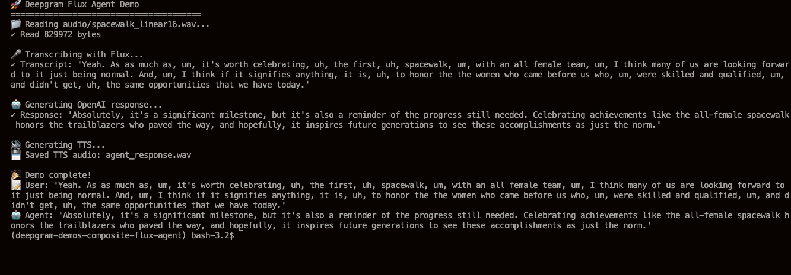

# Deepgram Flux Composite Agent

A simple terminal-based Python application that demonstrates the Deepgram Flux API integrated with OpenAI and Deepgram TTS. This demo processes a static audio file and creates a basic agent experience entirely in the terminal.

**Features:**
- 🎤 **Flux Transcription**: Real-time transcription using Deepgram's Flux API
- 🤖 **OpenAI LLM**: Processes audio to respond like an agent
- 🔊 **Deepgram TTS**: Natural voice synthesis for agent responses
- 🖥️ **Terminal-only**: No UI needed - everything runs in your terminal
- 📁 **Static Audio**: Processes your converted linear16 audio files

## What It Does

The application follows this simple pipeline:

1. **📁 Audio Loading**: Reads your converted linear16 audio file
2. **🎤 Flux Transcription**: Sends audio to Deepgram Flux API for real-time transcription
3. **🤖 OpenAI Response**: Generates intelligent responses using `GPT-4o-mini`
4. **🔊 TTS Generation**: Converts the response to speech using Deepgram TTS
5. **💾 Audio Output**: Saves the agent's speech as `audio/responses/agent_response.wav`

## Getting an API Key

🔑 To access the Deepgram API you will need a [free Deepgram API Key](https://console.deepgram.com/signup?jump=keys).

🔑 To access the OpenAI API you will need a [free OpenAI API Key](https://platform.openai.com/api-keys).


## Installation

1. Install the required packages:
   ```bash
   pip install deepgram-sdk
   pip install python-dotenv
   ```

## Running the Demo

1. Create a `.env` file with your API keys:
   ```bash
   DEEPGRAM_API_KEY=your_deepgram_api_key_here
   OPENAI_API_KEY=your_openai_api_key_here
   ```

2. Use the default audio file provided `OR` add your audio file to the `audio/` directory and convert to linear16 format:

   ```bash
   # Convert your audio file to the required format for Flux
   ffmpeg -i audio/your_file.wav -ar 16000 -ac 1 -c:a pcm_s16le audio/your_file_linear16.wav
   ```
   Then update the `AUDIO_FILE` path in `main.py` to point to your converted file.

3. Run the demo:
   ```bash
   python main.py
   ```

## Example Output



## Customization

You can modify the following in `main.py`:

- **TTS model**: Change `"aura-2-phoebe-en"` to other voices (aura-2-apollo-en, etc.)
- **Audio filename**: Change `AUDIO_FILE` to use a different filename
- **Response logic**: Modify the response generation to create different agent behaviors

## Troubleshooting

1. **Missing API Key**: Set `DEEPGRAM_API_KEY` and `OPENAI_API_KEY` environment variables
2. **Missing Audio File**: Add audio file to `audio/` directory and convert with FFMPEG
3. **Wrong Audio Format**: Flux requires linear16 - use FFMPEG command above
4. **SDK Import Error**: Install the Deepgram SDK correctly
5. **Connection Issues**: Check internet connection and API key validity

## Documentation

You can learn more about Deepgram APIs at [developers.deepgram.com](https://developers.deepgram.com/docs).

## Getting Help

We love to hear from you! If you have questions:

- [Join the Deepgram Github Discussions Community](https://github.com/orgs/deepgram/discussions)
- [Join the Deepgram Discord Community](https://discord.gg/xWRaCDBtW4)
